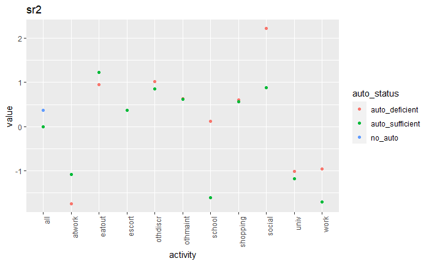

# Comparison between BEAM and ActivitySim
## Available Modes
The available modal options in BEAM and ActivitySim are different in a few ways. They are different in the number of available modes and also the selection of available modes. Let's look in detail at the 7 modes available in BEAM and then the 18 modes available in ActivitySim.

*BEAM's Available Modes*:

  - Walk
  - Car
  - Bike
  - Ride Hail
  - Ride Hail Pooled
  - walk Transit
  - Drive Transit
  - Bike Transit
  - Ride Hail Transit
  
*ActivitySim's Available Modes*:

  - Walk
  - Bike
  - Drive-Alone Free (Car)
  - Drive-Alone Pay (Car)
  - Shared 2 Free (Car)
  - Shared 2 Pay (Car)
  - Shared 3+ Free (Car)
  - Shared 3+ Pay (Car)
  - Walk-Local (Walk-Transit)
  - Walk-Express (Walk-Transit)
  - Walk-Commuter Rail (Walk-Transit)
  - Walk-LRT (Walk-Transit)
  - Walk-BART (Walk-Transit)
  - Drive-Local (Drive-Transit)
  - Drive-Express (Drive-Transit)
  - Drive-Commuter Rail (Drive-Transit)
  - Drive-LRT (Drive-Transit)
  - Drive-BART (Drive-Transit)

A main difference between the two models is that ActivitySim separates the car mode into 6 subgroups, the walk-transit mode into 5 subgroups, and the drive-transit mode into 5 subgroups as well. BEAM doesn't differentiate between specific car, walk-transit, and drive-transit modes. Another important difference to note is that BEAM includes the ride hail and ride hail pooled modes, whereas ActivitySim does not. 

The first difference (the subgroups under car, walk-transit, and drive-transit) hopefully will not affect the BEAM mode decision too much. On the other hand, the non-existant ride hail mode may prove difficult to accurately represent in further calibration. For example, if the ultimate goal is to mimic the ActivitySim tour and trip mode choice models in BEAM, how will ride hail vehicles be represented?

## Mode Choice Parameters
As a way to explain the need for calibrating BEAM's mode choice model with ActivitySim, the mode choice parameters were compared between the two models. More specifically, calibrated ActivitySim outputted tour mode coefficients for Salt Lake City were compared with some of the default config parameters of BEAM. 

Let's take a look at the charts that show this comparison.I appologize that there is no comparison between Shared Ride 2 and Shared Ride 3+. These modes do not exist in BEAM, but I guess I could have used the car mode instead. Oh well.

  
  

  
  

  
  

  
  

  
  

  
  

  
  

  
  

# Future Calibration
## Questions

  1. Should we use the calibrated utility parameters from ActivitySim relating to the tour mode choice? If so, what is the utility function for determining tour mode? Would using the current sequence in BEAM be sufficient for determining tour mode? Probably not. So this would be the first step in calibrating the BEAM model to handle the inputs from ActivitySim -- See Method 1. 
  2. How will the difference in modal options between ActivitySim and BEAM be represented. Maybe we can keep the 7 modes, but how will ride hail be represented when determining if it is a valid trip/tour mode choice? We cannot simply copy the ActivitySim model, because it does not include ride hail. Also, are we going to igore the 18 modes of ActivitySim, and simplify them to the 7 in BEAM, or do we add more modal options?   
 3. If we do not expand the number of modes, how important is it to make the modes be selected on a trip basis, if we only have 7 options? There probably won't be much overlap between these simple 7 modes. Or is there a good amount of overlap? How much could there be with just 7 modes? 
  3. How is a tour purpose determined? 
  
  
## Possible Methods

  1. **Tour Purpose**: Determine the tour purpose for each individual plan. This is important to determining tour and trip modes. 
  2. **Tour Mode**: Adjust the tour mode choice process in BEAM. Use the ActivitySim utility function and its parameters to determine the utilty values for each modal alternative. Before determining the utility value, the tour purpose is noted, and the corresponding utility parameters are selected (the utility funciton is controlled by purpose). Then use a nested logit model, like that shown in Figure 4.1, to determine the optimal mode for each tour.
  3. **Trip Mode**: First, detect the tour mode that was selected previously. Determine the list of possible trip modes that are allowed in that given tour. The tour purpose is then noted, and the corresponding utility parameters are selected. A nested logit model is then used to determine the optimal mode for each trip, within each tour, depending on the tour purpose.
  4. 